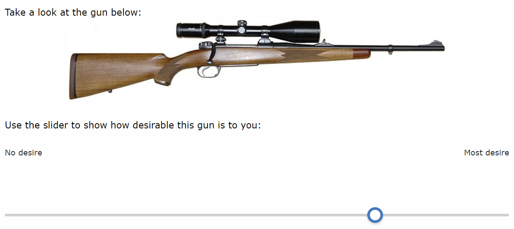

---
title: Justin Lucas Sola
filename: gun_desirability
layout: default

--- 
## Gun Desirability

There are advantages to capturing gradations of desire for guns rather than measuring past behavior (e.g. gun ownership) or asking what a participant will do (e.g. measures of intent). I developed and validated an index measure of gun desirability through a large national survey experiment: *Transmitting Desire* [(Sola 2021)](https://doi.org/10.1177/07311214211007179). If you use the measure, please cite it. You can implement it in Qualtrics quickly:

### 1) Question formatting and HTML code

Gun desirability is an index of three intervals measures: pistol desirability, AR-15 desirability, and hunting rifle desirability. The three questions are presented on the same page with random ordering. Each question prompts the participant to click and drag a horizontal sliding scale from 'No Desire' (lefthand side, internally recorded as 0) to 'Most Desire' (righthand side, internally recorded as 100).

No value is shown to the participant, a response is 'requested' rather than 'forced', and the mobile-friendly option is checked.

For the [hunting rifle image](./files/hunting_rifle.png) I use 75% of screen width (the code below reflects this). For the [AR-15 image](./files/ar-15.png) I use 70% width, with 40% for the [pistol image](./files/pistol.png). Edit the following question HTML to suit 1) the source image address and 2) relative width:
```
Take a look at the gun below:
<div style="text-align: center;"></div>
<br />
Use the slider to show how desirable this gun is to you:
```

The appropriate font size on the labels ('No Desire' at the left, 'Most Desire' at the right) depends on the formatting of the rest of your survey - I use 12-point font.

### 2) JavaScript code

I use the following JavaScript code for each question. Just copy-paste:
```
/* hides slider 'handle' until participants clicks 
Qualtrics.SurveyEngine.addOnload(function()
{
	var q = jQuery("#"+this.questionId);
	q.find(".handle").css('visibility', 'hidden');
	q.find(".track").on("click , touchstart", function() {
	jQuery(this).find(".handle").css('visibility', 'visible');
});

/* 1st default block
Qualtrics.SurveyEngine.addOnReady(function()
{
	/*Place your JavaScript here to run when the page is fully displayed*/
});

/* 2nd default block
Qualtrics.SurveyEngine.addOnUnload(function()
{
	/*Place your JavaScript here to run when the page is unloaded*/
});
```

### 3) End result

When participants encoutner the question, there should be no default value (aka anchor point). After clocking on the slider, a handle appears to mark the value selected along the interval. See an example below:
<style> img { max-width: 76%; height: auto; padding: 8px } </style>

